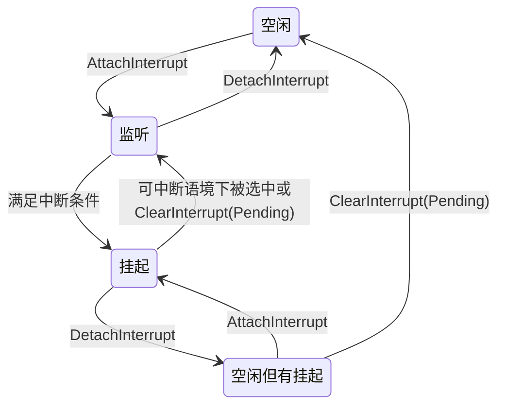

内置的引脚读写函数`digitalRead`和`digitalWrite`需要每次将引脚转换成寄存器地址再进行读写，而且还需要检查PWM计时器设定，虽然增加了可靠性，减少了内存占用，但是性能较低，无法满足超高频操作的需求。内置的引脚中断操作功能也十分有限。本库牺牲一定内存空间和与其它功能的兼容性和稳健性，追求使用尽可能少的指令周期完成引脚操作，并支持内置函数所欠缺的一些扩展功能。
# 统一模型
本库操纵的目标是引脚。引脚是从0开始逐一编号的`uint8_t`，其物理位置和最大值因具体设备产品而异。为了尽可能屏蔽不同架构之间的硬件设计差异，本库规定具有如下特征的统一引脚模型：
## 模式和状态
<table>
<tr><th colspan="2" rowspan="2"></th><th colspan="2">使用PinMode切换或查看当前工作模式</th></tr>
<tr><th>OUTPUT状态可用DigitalWrite或DigitalToggle切换</th><th>INPUT状态是只读的</th></tr>
<tr><th rowspan="2">使用DigitalRead获知当前状态</th><th>HIGH</th><td>输出高电平</td><td>读入高电平</td></tr>
<tr><th>LOW</th><td>输出低电平</td><td>读入低电平</td></tr>
</table>

- 引脚具有`OUTPUT`和`INPUT`两种工作模式。`INPUT`模式下可以从引脚读入外部接入的信号，`OUTPUT`模式下程序可以控制引脚对外输出信号。使用`PinMode`方法查看或更改当前的模式。
- 两种工作模式都具有`HIGH`和`LOW`两种状态。`HIGH`状态下引脚读入/输出高电平，`LOW`状态下引脚读入/输出低电平。两种模式的状态互相独立，同时存在。使用`DigitalRead`方法获知引脚在指定或当前工作模式下的状态。例如，即使引脚处于`INPUT`模式，也可以获知其`OUTPUT`状态，只是该状态不会真正输出；同样，即使引脚处于`OUTPUT`模式，也可以获知其`INPUT`状态，只是该状态可能不符合实际物理输入。
- 使用`DigitalWrite`方法改变引脚在`OUTPUT`模式下的状态，使用`DigitalToggle`方法反转引脚在`OUTPUT`模式下的状态。这些方法即使在`INPUT`模式下也可以使用，但是不会真正改变引脚的输出状态，只有切换到`OUTPUT`模式后才会生效。`INPUT`模式的状态是只读的。
## 中断
只有部分引脚支持中断功能。使用`PinInterruptable`可以在编译或运行时检查引脚是否支持中断，也可以查阅具体的设备产品文档获知。

<table>
<tr><th></th><th colspan="2">使用InterruptEnabled区分</th></tr>
<tr><th rowspan="2">使用(Clear)InterruptPending区分</th><td>空闲</td><td>监听</td></tr>
<tr><td>空闲但有挂起</td><td>挂起</td></tr>
</table>

- 每个引脚可能处于空闲、监听、挂起、空闲但有挂起四种状态之一。使用`InterruptEnabled`方法检查指定引脚是否处于监听或挂起状态。使用`InterrputPending`（AVR）或`ClearInterruptPending`（SAM）方法检查指定引脚是否处于挂起或空闲但有挂起状态。
- 使用`AttachInterrupt`方法将一个可调用对象作为中断处理方法附加到指定引脚，并选择一个中断条件（通常有高低升降变五种条件，具体需查看设备的产品文档）。一个引脚只能有一个中断条件和一个处理方法，重复附加则以最后一个为准；不同引脚则相互独立。如果引脚原本空闲，使其进入监听状态；如果引脚原本空闲但有挂起，则进入挂起状态。`DetachInterrupt`是其逆操作。
- 监听状态下，如果引脚满足中断条件，则进入挂起状态。在可中断语境下，将按照由具体设备产品决定的策略，从所有挂起的引脚中选择其一，首先使其返回监听状态，然后执行处理方法。处理方法执行中，属于不可中断语境，挂起的引脚将保持挂起状态，但监听的引脚如满足条件仍可立即挂起（即使正在处理的就是该引脚上次的挂起）。
- 使用`ClearInterrupt`（AVR）或`ClearInterruptPending`（SAM）方法取消挂起的中断事件，强迫挂起的引脚跳过中断处理直接返回监听状态，空闲但有挂起的引脚直接返回空闲状态。
- 存在一个全局性控制所有引脚中断功能的开关。使用`GlobalInterruptEnabled`可以查看当前是否全局启用中断，使用内置`interrupts`和`noInterrupts`可以启用和禁用全局中断。全局中断禁用时，监听的引脚不会挂起，挂起的引脚也不会自动被选中执行处理方法而返回监听状态。只能使用本库提供的方法进行手动状态切换。
# API参考
每种方法都有多个重载，以适应不同的编译期（模板）/运行时参数组合。调用时应尽可能多使用模板参数，以减少运行时开销。
```C++
namespace Quick_digital_IO_interrupt
{
	/*
	引脚IO操作。主要是增强内置方法的功能和性能，额外提供便捷的引脚翻转功能。
	*/

	// 获知引脚工作于OUTPUT还是INPUT模式。
	inline bool PinMode(uint8_t Pin);
	template <uint8_t Pin>
	inline bool PinMode();

	// 切换引脚工作模式到OUTPUT或INPUT。
	inline void PinMode(uint8_t Pin, bool OutOrIn);
	template <uint8_t Pin>
	inline void PinMode(bool OutOrIn);
	template <bool OutOrIn>
	inline void PinMode(uint8_t Pin);
	template <uint8_t Pin, bool OutOrIn>
	inline void PinMode();

	// 从引脚读取状态（HIGH或LOW）。额外指定读取OUTPUT还是INPUT模式的状态。
	inline bool DigitalRead(uint8_t Pin, bool OutOrIn);
	template <uint8_t Pin>
	inline bool DigitalRead(bool OutOrIn);
	template <bool OutOrIn>
	inline bool DigitalRead(uint8_t Pin);
	template <uint8_t Pin, bool OutOrIn>
	inline bool DigitalRead();

	// 从引脚读取状态（HIGH或LOW）。根据引脚当前工作模式，决定读取OUTPUT还是INPUT状态。由于存在检查工作模式的开销，建议尽可能选择指定读取OUTPUT还是INPUT状态的重载。
	inline bool DigitalRead(uint8_t Pin);
	template <uint8_t Pin>
	inline bool DigitalRead();
	
	// 将引脚OUTPUT状态设为HIGH或LOW。如果引脚当前工作于INPUT模式，此操作不会立即改变引脚的实际输出，只有切换到OUTPUT模式后才会生效。
	inline void DigitalWrite(uint8_t Pin, bool HighOrLow);
	template <uint8_t Pin>
	inline void DigitalWrite(bool HighOrLow);
	template <bool HighOrLow>
	inline void DigitalWrite(uint8_t Pin);
	template <uint8_t Pin, bool HighOrLow>
	inline void DigitalWrite();

	// 反转引脚的OUTPUT状态：若为HIGH则变LOW，若为LOW则变HIGH
	inline void DigitalToggle(uint8_t Pin);
	template <uint8_t Pin>
	inline void DigitalToggle();

	/*
	引脚中断操作。本库提供的中断附加和移除操作可以按需与内置方法混用，不要求附加和移除方法版本配对使用，不会产生异常。
	*/

	// 检查引脚是否支持中断功能。出于性能考虑，本库中其它中断操作均不会检查引脚支持性，尝试对不支持的引脚附加中断是未定义行为。
	inline constexpr bool PinInterruptable(uint8_t Pin);

	// 检查全局设置中断是否启用。如禁用，所有引脚的中断均不工作。使用内置interrupts()和noInterrupts()来启用和禁用全局中断。
	inline bool GlobalInterruptEnabled();

	// 将任意可调用对象作为引脚的中断处理方法，并设置中断条件。此方法仅用于支持复杂的可调用对象，实际性能低于内置attachInterrupt，无论是在附加时还是在中断处理时都会有额外开销。如果你只需要附加一个简单的函数指针，应使用内置方法。对象会在下次调用AttachInterrupt（非内置）时被析构，在那之前其所拥有的资源将不会被释放。
	inline void AttachInterrupt(uint8_t Pin, std::move_only_function<void() const> &&ISR, int Mode);
	template <uint8_t Pin>
	inline void AttachInterrupt(std::move_only_function<void() const> &&ISR, int Mode);
	template <int Mode>
	inline void AttachInterrupt(uint8_t Pin, std::move_only_function<void() const> &&ISR);
	template <uint8_t Pin, int Mode>
	inline void AttachInterrupt(std::move_only_function<void() const> &&ISR);

	// 检查指定引脚是否已附加中断，即处于监听或挂起状态。
	template <uint8_t Pin>
	inline bool InterruptEnabled();
	inline bool InterruptEnabled(uint8_t Pin);

	// 停止处理指定引脚的中断。如果引脚空闲或空闲但挂起，也不会产生异常。此方法不会析构AttachInterrupt传入的可调用对象。此方法是AttachInterrupt的逆操作。
	template <uint8_t Pin>
	inline void DetachInterrupt();
	inline void DetachInterrupt(uint8_t Pin);

#ifdef ARDUINO_ARCH_AVR
	// AVR架构专有方法

	// 检查指定引脚是否有中断事件挂起。
	template<uint8_t Pin>
	inline bool InterruptPending();
	inline bool InterruptPending(uint8_t Pin);

	// 取消引脚挂起的中断事件。如果引脚未挂起，也不会产生异常。
	template <uint8_t Pin>
	inline void ClearInterrupt();
	inline void ClearInterrupt(uint8_t Pin);
#endif
#ifdef ARDUINO_ARCH_SAM
	// SAM架构专有方法

	// 检查引脚是否有中断事件挂起：若有，则取消挂起。由于SAM架构设计使然，此方法还会同时清除指定引脚之外的某些引脚的挂起状态，详见SAM架构数据表。但是，此方法确保只返回指定引脚的挂起状态。
	template<uint8_t Pin>
	inline bool ClearInterruptPending();
	inline bool ClearInterruptPending(uint8_t Pin);
#endif
}
```